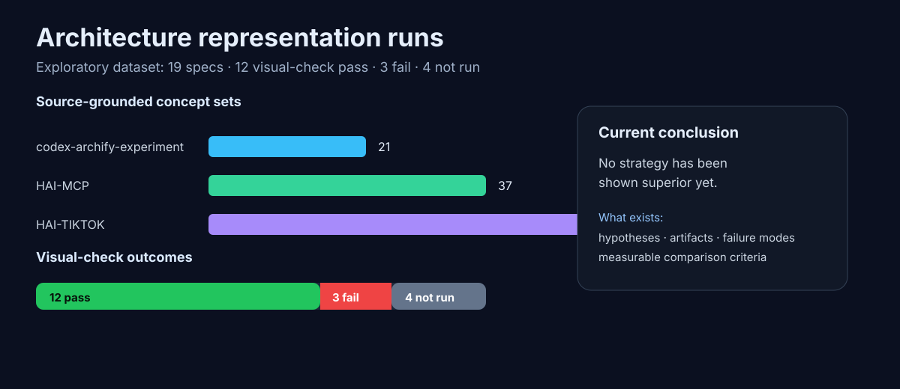
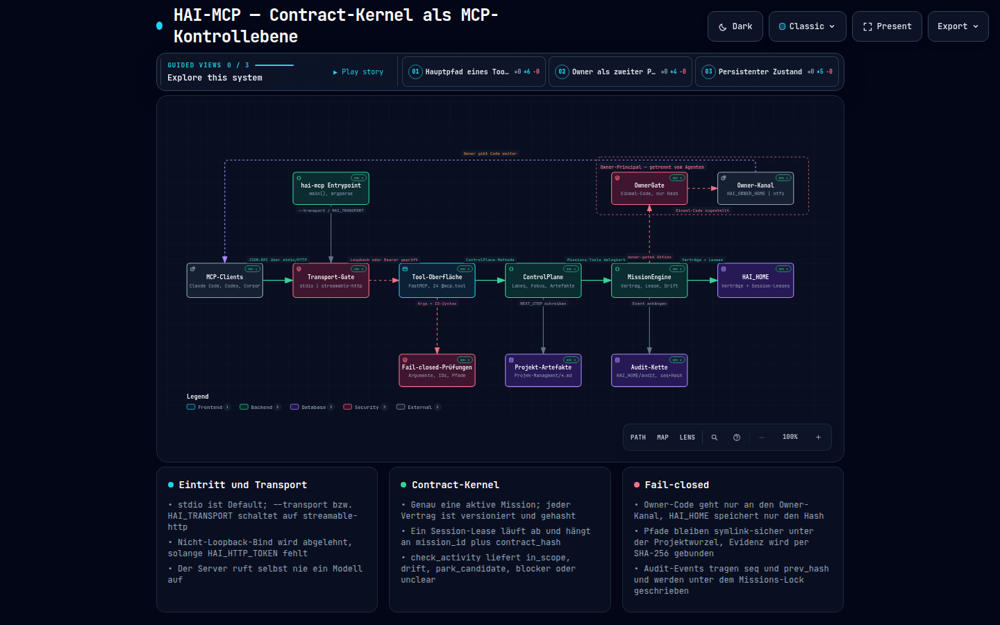
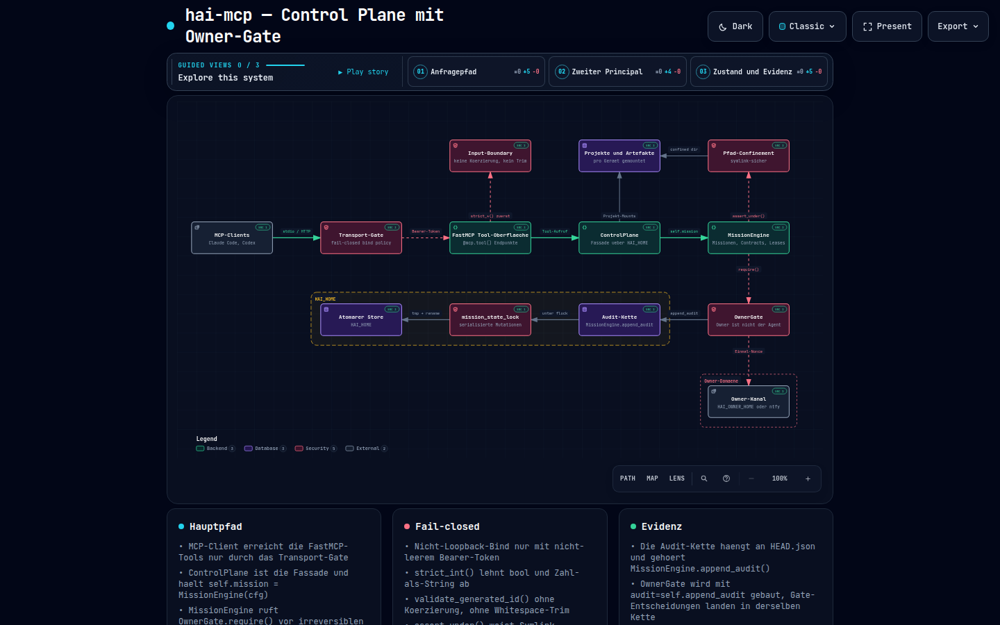
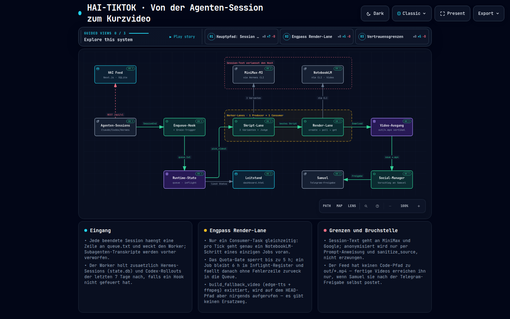
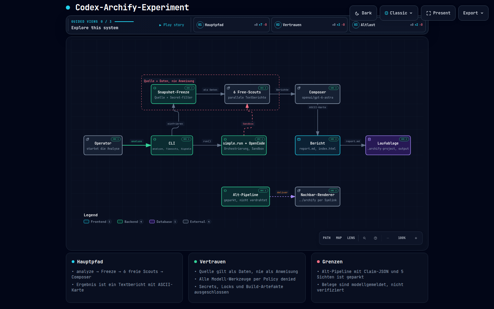

# Archify Free-Pipeline Research

Exploratory research on whether redundant full-repository scouting or specialized scouting produces better source-grounded architecture representations when a stronger model composes the final map.



## Research question

Does redundant full-repository scouting or specialized scouting produce better source-grounded architecture representations when composed by a stronger model?

Status: Exploratory. No strategy has been shown superior yet.

## Why this exists

This repository preserves a research trail around Archify as a cognitive checkpoint after agentic coding work. The goal is not to prove that one orchestration strategy wins. The current value is narrower and more honest:

- keep source-grounded claims instead of model prose only;
- compare what different models notice or omit;
- separate technical pipeline success from human-comprehensible architecture output;
- document failure modes before declaring a harness reliable.

## Current evidence snapshot

| Dataset / target repo | Source-grounded concepts | Model diagrams measured | Visual-check pass | Visual-check fail | Not run |
| --- | ---: | ---: | ---: | ---: | ---: |
| HAI-MCP | 37 | 8 | 6 | 1 | 1 |
| HAI-TIKTOK | 54 | 7 | 3 | 2 | 2 |
| codex-archify-experiment | 21 | 4 | 3 | 0 | 1 |
| Total | 112 | 19 | 12 | 3 | 4 |

Visual-check means automated browser evidence from Archify, not human perceptual approval. A pass says the artifact fit/readability checks passed in the measured browser viewports; it does not prove semantic superiority.

## Representative artifacts

### HAI-MCP, Opus map: visual-check pass



- 37 merged source-grounded concepts in the claim set.
- 12 components, 12 connections, 3 guided views.
- Automated visual-check: pass, 0 diagnostics, 0 overflow viewports.

### HAI-MCP, composed map: more evidence is not automatically better



- Same 37-concept claim base, composed into 13 components and 13 connections.
- Automated visual-check: fail, 3 diagnostics, 2 overflowing measured viewports.
- Lesson: aggregation can preserve more findings while producing a worse first-screen artifact.

### HAI-TIKTOK, Opus map: larger repo case



- 54 merged source-grounded concepts.
- 12 components, 11 connections, 3 guided views.
- Automated visual-check: pass.

### codex-archify-experiment, Muse map: failure-lineage as data



- 21 merged source-grounded concepts.
- 10 components, 9 connections, 3 guided views.
- Automated visual-check: pass.

## Experimental design

The controlled comparison still needs to be run cleanly:

```text
same repository
same commit
same model pool
same budget class
        │
        ├── A: redundant full-repository scouting
        │
        └── B: specialized scouting by analysis area
                │
        same stronger aggregator
        same architecture-map assignment
                ↓
source correctness · important findings · omissions
comprehensibility · time · cost · failure behavior
```

## What is measured

The project tracks more than whether HTML was produced:

- source correctness: paths, lines, functions, and responsibilities;
- important findings: central architecture facts, including minority discoveries;
- omissions: important components absent from a candidate map;
- visual artifact health: viewport containment, readability, diagnostics;
- human usefulness: whether the owner can explain the system top-down from the artifact;
- robustness: timeouts, invalid JSON, missing scouts, unavailable model slugs;
- cost/time: model cost, wall time, and wasted runs.

## Data

- `data/architecture-runs.csv` — compact run table.
- `data/architecture-runs.json` — machine-readable summary and run metrics.
- `data/hai-mcp.claims.md` — 37 verified HAI-MCP concepts.
- `data/hai-tiktok.claims.md` — 54 verified HAI-TIKTOK concepts.
- `data/codex-archify-experiment.claims.md` — 21 verified codex-archify-experiment concepts.
- `Wissehscaflichterversuchsaufbau.md` — German research framing and caveats.

## Current conclusion

No orchestration strategy has been shown superior yet.

The scientific value so far is exploratory: the repository contains hypotheses, failure modes, source-grounded claim sets, screenshots, and measurement criteria that make the next comparison auditable instead of anecdotal.
