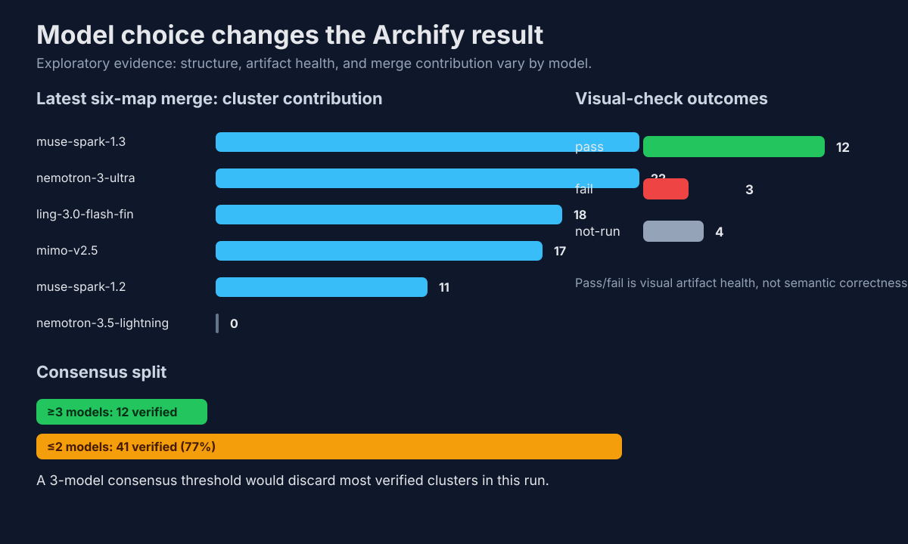

# Model choice impact

This page makes visible how model choice changed the Archify result. It compares structure, visual-check health, screenshots, and merge contribution.

Status: exploratory. Visual-check pass/fail is artifact health, not semantic truth. In the merge, “verified” first means the referenced code location exists.

## Latest fan-out contribution

The newer six-map run shows why a consensus-only filter would be harmful here: 41 of 53 verified clusters were found by only one or two models.

| Model | Merge clusters |
| --- | ---: |
| `muse-spark-1.3` | 22 |
| `nemotron-3-ultra` | 22 |
| `ling-3.0-flash-fin` | 18 |
| `mimo-v2.5` | 17 |
| `muse-spark-1.2` | 11 |
| `nemotron-3.5-lightning` | 0 |

Caveat: `nemotron-3.5-lightning` contributed 0 clusters here, so “usable candidate” and “merge-usable source evidence” must be reported separately.

## Published Archify maps by model

| Target | Model | Concepts | Components | Connections | Views | Visual check | Diagnostics | HTML | Screenshot |
| --- | --- | ---: | ---: | ---: | ---: | --- | ---: | --- | --- |
| codex-archify-experiment | `muse-spark-1.3` | 21 | 10 | 9 | 3 | pass | 0 | [html](../generated/cae.architecture.muse-spark-1.3.html) | [png](../generated/cae.architecture.muse-spark-1.3.visual-check.1440x900.dark.png) |
| codex-archify-experiment | `mimo-v2.5` | 21 | 9 | 10 | 3 | pass | 0 | [html](../generated/cae.architecture.mimo-v2.5.html) | [png](../generated/cae.architecture.mimo-v2.5.visual-check.1440x900.dark.png) |
| codex-archify-experiment | `nemotron-3.5-lightning` | 21 | 8 | 7 | 0 | pass | 0 | [html](../generated/cae.architecture.nemotron-3.5-lightning.html) | [png](../generated/cae.architecture.nemotron-3.5-lightning.visual-check.1440x900.dark.png) |
| codex-archify-experiment | `nemotron-3-ultra` | 21 | 11 | 11 | 0 | not-run | 0 | not published | not published |
| hai-mcp | `baseline` | 37 | 10 | 10 | 3 | pass | 0 | [html](../generated/hai-mcp.architecture.html) | [png](../generated/hai-mcp.architecture.visual-check.1440x900.dark.png) |
| hai-mcp | `opus` | 37 | 12 | 12 | 3 | pass | 0 | [html](../generated/hai-mcp.architecture.opus.html) | [png](../generated/hai-mcp.architecture.opus.visual-check.1440x900.dark.png) |
| hai-mcp | `mimo` | 37 | 10 | 9 | 3 | pass | 0 | [html](../generated/hai-mcp.architecture.mimo.html) | [png](../generated/hai-mcp.architecture.mimo.visual-check.1440x900.dark.png) |
| hai-mcp | `muse` | 37 | 10 | 11 | 3 | pass | 0 | [html](../generated/hai-mcp.architecture.muse.html) | [png](../generated/hai-mcp.architecture.muse.visual-check.1440x900.dark.png) |
| hai-mcp | `minimax` | 37 | 12 | 11 | 0 | pass | 0 | [html](../generated/hai-mcp.architecture.minimax.html) | [png](../generated/hai-mcp.architecture.minimax.visual-check.1440x900.dark.png) |
| hai-mcp | `haiku` | 37 | 10 | 9 | 0 | pass | 0 | [html](../generated/hai-mcp.architecture.haiku.html) | [png](../generated/hai-mcp.architecture.haiku.visual-check.1440x900.dark.png) |
| hai-mcp | `nemoultra` | 37 | 13 | 15 | 3 | not-run | 0 | not published | not published |
| hai-mcp | `composed` | 37 | 13 | 13 | 3 | fail | 3 | [html](../generated/hai-mcp.architecture.composed.html) | [png](../generated/hai-mcp.architecture.composed.visual-check.1440x900.dark.png) |
| hai-tiktok | `opus` | 54 | 12 | 11 | 3 | pass | 0 | [html](../generated/hai-tiktok.architecture.opus.html) | [png](../generated/hai-tiktok.architecture.opus.visual-check.1440x900.dark.png) |
| hai-tiktok | `mimo-v2.5` | 54 | 9 | 7 | 3 | pass | 0 | [html](../generated/hai-tiktok.architecture.mimo-v2.5.html) | [png](../generated/hai-tiktok.architecture.mimo-v2.5.visual-check.1440x900.dark.png) |
| hai-tiktok | `muse-spark-1.2` | 54 | 11 | 13 | 3 | pass | 0 | [html](../generated/hai-tiktok.architecture.muse-spark-1.2.html) | [png](../generated/hai-tiktok.architecture.muse-spark-1.2.visual-check.1440x900.dark.png) |
| hai-tiktok | `ling-3.0-flash-fin` | 54 | 11 | 12 | 2 | fail | 6 | [html](../generated/hai-tiktok.architecture.ling-3.0-flash-fin.html) | [png](../generated/hai-tiktok.architecture.ling-3.0-flash-fin.visual-check.1440x900.dark.png) |
| hai-tiktok | `muse-spark-1.3` | 54 | 11 | 12 | 4 | fail | 6 | [html](../generated/hai-tiktok.architecture.muse-spark-1.3.html) | [png](../generated/hai-tiktok.architecture.muse-spark-1.3.visual-check.1440x900.dark.png) |
| hai-tiktok | `nemotron-3-ultra` | 54 | 11 | 11 | 0 | not-run | 0 | not published | not published |
| hai-tiktok | `nemotron-3.5-lightning` | 54 | 10 | 11 | 0 | not-run | 0 | not published | not published |

## What changes with model choice

- The same claim base can produce different map structures: component and connection counts vary by model.
- Some outputs pass visual checks while others fail despite using comparable source-grounded material.
- Models that do not finish HTML can still contribute to the merge if they produce source references.
- Low-overlap clusters are valuable: requiring agreement from at least three models would discard most of the verified clusters in the latest run.

## Direct data

- [`data/model-choice-impact.json`](../data/model-choice-impact.json)
- [`data/architecture-runs.csv`](../data/architecture-runs.csv)
- [`data/latest-specialized-scouting-result.json`](../data/latest-specialized-scouting-result.json)
